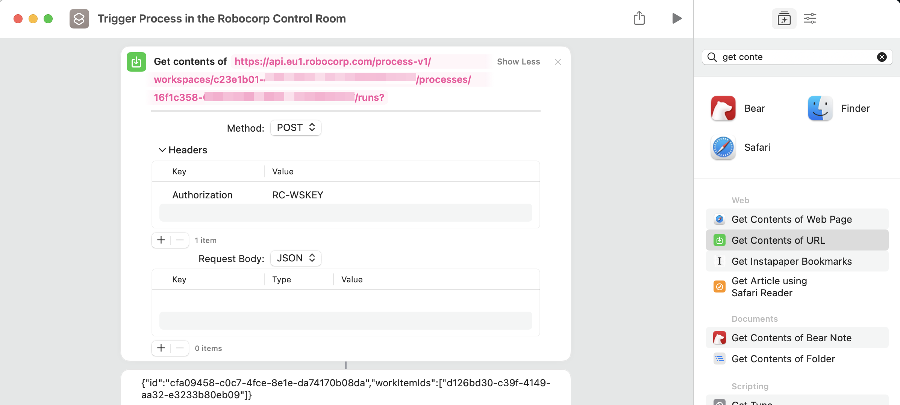
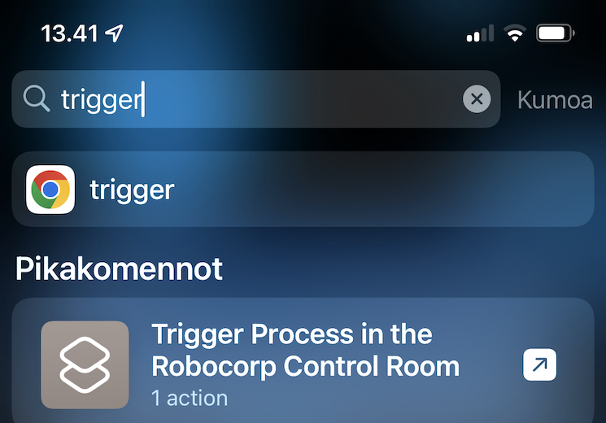

# Using Robocorp Control Room with Apple Shortcuts

This is an example on triggering a process in the Control Room (POST), but all API endpoints are usable and you could for example. use same mechanism to get information from the latest run, list latest runs..

## Things to note

1. When using iCloud sync, **all devices** connected to the iCloud account will get access to this Shortcut 

## Implement the shortcut with Mac application `Shortcuts`

If ICloud syncing is on between Mac and other IOS devices then implemented shortcut will appear almost instantly for example. on your iPhone.

1. Use `Get Contents of URL` in the Apple Shortcuts application and click `Show more`. Change method to `POST` and set `Authorization` header

2. After sync has happened the same Shortcut and be found with iPhone search, in my case with the name starting with `Trigger..`

